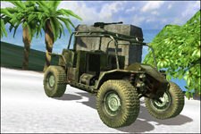

# Far Cry: Introduction to Data Science – Structured Query Language (SQL) Advanced


## Introduction

[Far Cry is a first-person shooter (FPS) video game](https://www.youtube.com/watch?v=Cz3vGM08S7Q&has_verified=1) with amazing graphics, developed by Crytek and published by Ubisoft. The game was released in 2004 for Microsoft Windows and was a huge commercial success. Ubisoft closed the online servers almost 12 years later.

Far Cry features several [multiplayer modes](https://www.youtube.com/watch?v=GaFM0uWAzh0) in which players basically score points by killing other players. One of these multiplayer modes is deathmatch, also known as free for all (FFA), where the goal is to kill (or frag, from the military term) as many other players as possible within a limited period of time. Basically, everything that moves SHOULD be killed… :)

### Multiplayer FFA Session

Players can join an online multiplayer session by connecting to a Far Cry server. A session starts for a configurable limited period of time, for example: 30 minutes, during which each player tries their best to seek out and kill other players.

When the limited period of time expires, the game stops and it displays the results of the match as an ordered leaderboard with the number of kills and deaths per player, and the efficiency of each player:


### Weapons

Players have access to a large arsenal of real-world weapons in Far Cry, from grenades and pistols, to rocket launchers, machines guns and sniper rifles. Check out [all of the weapons from good old Far Cry](https://www.youtube.com/watch?v=vzNG4VlCTFM)! They sound so cool!

| Name                                              | Code                                                  | Photo                                                  |
| ------------------------------------------------- | ----------------------------------------------------- | ------------------------------------------------------ |
| Machete                                           | `Machete`                                             |                      |
| Jungle Falcon                                     | `Falcon`                                              |                |
| Jackhammer Shotgun                                | `Shotgun`                                             |           |
| P90 SMG                                           | `P90`                                                 |                      |
| MP5 SMG                                           | `MP5`                                                 |                      |
| M4 Carbine                                        | `M4`                                                  |                   |
| AG36 Assault Rifle                                | `AG36` for the rifle, `AG36Grenade` for the explosive |           |
| OICW Advanced Assault Rifle                       | `OICW` for the rifle, `OICWGrenade` for the explosive |  |
| AW50 Sniper Rifle                                 | `SniperRifle`                                         |            |
| M249 SAW MG                                       | `M249`                                                |                  |
| Rocket Launcher                                   | `Rocket`                                              |              |
| Grenade                                           | `HandGrenade`                                         |                  |
| Mk.19 Mounted Mortar Launcher Platform            | `StickyExplosive`                                     |                       |
| Patrol Boat (when a player runs over another)     | `Boat`                                                |                 |
| Humvee or Buggy (when a player runs over another) | `Vehicle`                                             |                       |
| Rocket Launcher mounted on a vehicle              | `VehicleMountedRocketMG`                              |                      |
| Mounted Minigun                                   | `VehicleMountedAutoMG`, `MG`                          |               |
| Machine Gun mounted on a vehicle                  | `VehicleMountedMG`                                    |                       |
| Rocket Launcher mounted on a vehicle              | `VehicleRocket`                                       |                      |

_Note: AG36 Assault Rifle and OICW Advanced Assault Rifle weapons have two fire modes: automatic rifle and grenade launcher._

### Server Log: Frag History

The Far Cry server stores [log information in a text file](logs/log00.txt), starting with engine and system initialization data, followed by all the frags that occurred in every match sessions.

For example:

```bash
$ cat ./logs/log00.txt | grep killed | head
<26:32> <Lua> papazark killed lamonthe with AG36
<27:07> <Lua> theprophete killed lamonthe with Rocket
<27:18> <Lua> theprophete killed lamonthe with Rocket
<27:29> <Lua> theprophete killed lamonthe with Rocket
<27:47> <Lua> theprophete killed lamonthe with Rocket
<28:10> <Lua> theprophete killed papazark with Rocket
<28:49> <Lua> theprophete killed papazark with Rocket
<29:28> <Lua> papazark killed lamonthe with AG36
<29:36> <Lua> papazark killed lamonthe with AG36
<30:07> <Lua> theprophete killed papazark with SniperRifle
```

The format of a line corresponding to a frag, when a player kills another player, is:

```text
<MM:SS:> <Lua> killer_username killed victim_username with weapon_code
```

or the following format, when a player kills himself, e.g., when a stupid player miserably dies by throwing a grenade that eventually explodes at their feet...

```text
<MM:SS:> <Lua> killer_username killed itself
```

where:

- `MM`: Zero-padded minute between 00 and 59 of the time when the frag occurred;
- `SS`: Zero-padded second between 00 and 59 of the time when the frag occurred;
- `killer_username`: Username of the player who fragged another; can only contain letters, numbers, dashes ("`-`"), periods ("`.`"), and underscores (`_`);
- `victim_username`: Username of the player who has been fragged;
- `weapon_code`: Code name of the weapon that was used to frag the other player.

_Note: The time of a frag is relative to the time the Far Cry engine started. It represents the number of minutes/seconds elapsed between the moment the game engine started and when the frags occurred._

_Note: Players who joined a match but who hid during all the match, meaning they didn't kill anyone and they haven't been killed by anyone, don't appear in the frag history at all. We just ignore them._

You can download [Far Cry 1.34 on Windows](https://drive.google.com/file/d/1pQ5RFuQ3t669KXd_jV-2KoOONdT6NcY8/view?usp=sharing), [unzip](https://www.7-zip.org/) the archive on the disk of your computer, and run the executable `./Bin32/FarCry.exe`.


## Waypoint 1: Create PostgreSQL Database

We are going to create a database to store Far Cry game session data, like we did with SQLite.

PostgreSQL provides a [command-line inteface (CLI) program named `psql`](https://www.postgresql.org/docs/current/app-psql.html), similar to `sqlite3`, that enables you to type in queries interactively, issue them to PostgreSQL, and see the query results.

The way PostgreSQL creates a new database is a bit different from SQLite. It actually works [by copying an existing database](https://www.postgresql.org/docs/current/manage-ag-templatedbs.html). By default, it copies the standard system database named `template1`. Thus, that database is the “template” from which new databases are made.

Connect to your PostgreSQL server instance by specifying the name of the database `template1` to connect to:

For example:

```bash
$ psql template1
psql (11.2)
Type "help" for help.

template1=#
```

[Create a database](https://www.postgresql.org/docs/current/sql-createdatabase.html) named `farcry` with the character encoding [`UTF-8`](https://en.wikipedia.org/wiki/UTF-8). Nowadays we use [Unicode](https://www.w3.org/International/articles/definitions-characters/) to encode almost every international character. This is a [MUST HAVE](https://www.joelonsoftware.com/2003/10/08/the-absolute-minimum-every-software-developer-absolutely-positively-must-know-about-unicode-and-character-sets-no-excuses/).

You should be able to connect to your new database:

```bash
$ psql farcry
psql (11.2)
Type "help" for help.

farcry=#
```

## Waypoint 2: Create Tables Match and Match Frags

We are now going to create the tables `match` and `match_frag`.

This time, we will manage the identification of a match a bit differently. We have used auto-incremented integers to identify a match with SQLite. There may be other teams in the world who are playing Far Cry and calculating statistics about their game sessions. If we wanted to share statistics of all these Far Cry game sessions, we would face an issue with duplicated match identifications as these identifications will be generated on different RDBMS that all start generating identifications with `0`. We need to generate unique match identifications. This is what [Universally Unique IDentifier (UUID](https://en.wikipedia.org/wiki/Universally_unique_identifier) is for.

PostgreSQL is designed to be easily extensible. For this reason, extensions loaded into the database can function just like features that are built in. The best example is probably [PostGIS](http://postgis.net), a spatial database extender for PostgreSQL object-relational database.

Back to our unique match identification, the [uuid-ossp module](https://www.postgresql.org/docs/11/uuid-ossp.html) provides functions to generate UUIDs using one of several standard algorithms. This extension is not installed by default.

[Create the extension](https://www.postgresql.org/docs/11/sql-createextension.html) `uuid-ossp` and load it into our database `farcry`. Once this extension installed, you can use the function `uuid_generate_v1` to generate a version 1 UUID.

For example:

```shell
farcry=# SELECT uuid_generate_v1();
           uuid_generate_v1
--------------------------------------
 2e49b26e-61b6-11e9-a222-8c85902ac91a
(1 row)
```

_Note: The generation of a version 1 UUID involves the MAC address of the computer and a time stamp. It is therefore unique. Note that UUIDs of this kind reveal the identity of the computer that created the identifier and the time at which it did so, which might make it unsuitable for certain security-sensitive applications._

We are now going to create the tables `match` and `match_frag` with [Data Definition Language (DDL)](https://en.wikipedia.org/wiki/Data_definition_language) queries.

[Create the table](https://www.postgresql.org/docs/current/sql-createtable.html) `match` with the following columns:

| Name         | Data Type                                                                          | Nullable? | Default Value        |
| ------------ | ---------------------------------------------------------------------------------- | --------- | -------------------- |
| `match_id`   | [`uuid`](https://www.postgresql.org/docs/9.1/datatype-uuid.html)                   | No        | `uuid_generate_v1()` |
| `start_time` | [`timestamptz(3)`](https://www.postgresql.org/docs/current/datatype-datetime.html) | No        |                      |
| `end_time`   | [`timestamptz(3)`](https://www.postgresql.org/docs/current/datatype-datetime.html) | No        |                      |
| `game_mode`  | [`text`](https://www.postgresql.org/docs/current/datatype-character.html)          | No        |                      |
| `map_name`   | [`text`](https://www.postgresql.org/docs/current/datatype-character.html)          | No        |                      |

Create the table `match_frag` with the following columns:

| Name          | Data Type        | Nullable? | Default Value |
| ------------- | ---------------- | --------- | ------------- |
| `match_id`    | `uuid`           | No        |               |
| `frag_time`   | `timestamptz(3)` | No        |
| `killer_name` | `text`           | No        |               |
| `victim_name` | `text`           | Yes       |               |
| `weapon_code` | `text`           | Yes       |               |

[Alter the table](https://www.postgresql.org/docs/current/sql-altertable.html) `match` to add the primary key constraint on column `match_id`. Name this constraint `pk_match_match_id`.

Alter the table `match_frag` to add the foreign key constraint on column `match_id` referencing the same column of table `match`. Name this constraint `fk_match_frag_match_id`. Configure this constraint so that it updates the value `match_id` (if it was changed in the parent table `match`). Configure this constraint so that it refuses to delete records in the parent table `match` if there are dependent records in table `match_frag`.

## Waypoint 3: Insert Game Session Data to PostgreSQL Database

Write a function `insert_match_to_postgresql` that takes the following arguments:

- `properties`: a tuple of the following form:

  `(hostname, database_name, username, password)`

  where:

  - `hostname`: hostname of the PosgtreSQL server to connect to;
  - `database_name`: name of the database to use;
  - `username`: username of the database account on which the connection is being made;
  - `password`: password of the database account.

- `start_time`: a datetime.datetime object with time zone information corresponding to the start of the game session;

- `end_time`: a datetime.datetime object with time zone information corresponding to the end of the game session;

- `game_mode`: multiplayer mode of the game session:

  - `ASSAULT`: There are two teams, one is defending a flag and the other team is attacking it. Each maps has 3 flags and if after 20 minutes not all flags are captured, the teams switch sides. The flags are in fixed positions on the map and only one flag at the time is active;
  - `TDM` (Team DeathMatch): There are two teams. Players of one team kill members of the other team;
  - `FFA` (Free-For-All): Players kill anyone they can find.

- `map_name`: Name of the map that was played.

- `frags`: A list of tuples in the following form:

  `(frag_time, killer_name[, victim_name, weapon_code])`

  where:

  - `frag_time` (required): datetime.datetime with time zone when the frag occurred;
  - `killer_name` (required): username of the player who fragged another or killed himself;
  - `victim_name` (optional): username of the player who has been fragged;
  - `weapon_code` (optional): code of the weapon that was used to frag.

The function `insert_match_to_postgresql` inserts a new record into the table `match` with the arguments `start_time`, `end_time`, `game_mode`, and `map_name`, using an [`INSERT` statement](https://www.postgresql.org/docs/current/sql-insert.html). You need to use the Python module [`psycopg2`](http://initd.org/psycopg/docs/).

The function `insert_match_to_postgresql` inserts all the frags into the table `match_frag`.

The function `insert_match_to_postgresql` returns the identification of the match that has been inserted.

For example:

```python
>>> log_data = read_log_file('./logs/log01.txt')
>>> log_start_time = parse_log_start_time(log_data)
>>> game_mode, map_name = parse_match_game_mode_and_map_name(log_file_data)
>>> frags = parse_frags(log_data)
>>> start_time, end_time = parse_match_start_and_end_times(log_data, log_start_time, frags)
>>> properties = ('localhost', 'farcry', None, None)
>>> insert_match_to_postgresql(properties, start_time, end_time, game_mode, map_name, frags)
'57d54a44-61d9-11e9-a222-8c85902ac91a'
```

_Note: [PostgreSQL recommends not to use `lastrowid`](http://initd.org/psycopg/docs/cursor.html?highlight=lastrowid#cursor.lastrowi?). Instead you should use the form [`INSERT ... RETURNING`](https://www.postgresql.org/docs/11/dml-returning.html)._

## Waypoint 4: Determine the Most Versatile Killer

The most versatile killer is the player who killed others with the maximum number of different weapons.


Write an SQL query that sorts players in descending number of different weapons they have used to kill other players in a match.

For example:

```sql
               match_id               |   killer_name   | weapon_count
--------------------------------------+-----------------+--------------
 0c8e7c3c-61ab-11e9-b4aa-8c85902ac91a | Refactorer      |           13
 0c8e7c3c-61ab-11e9-b4aa-8c85902ac91a | cyap            |            9
 0c8e7c3c-61ab-11e9-b4aa-8c85902ac91a | Jack The Reaper |            4
 0c8e7c3c-61ab-11e9-b4aa-8c85902ac91a | cynthia         |            3
 770df362-61ab-11e9-9617-8c85902ac91a | Mike Killah     |           11
 770df362-61ab-11e9-9617-8c85902ac91a | papazark        |           11
 770df362-61ab-11e9-9617-8c85902ac91a | cyap            |            9
 770df362-61ab-11e9-9617-8c85902ac91a | lamonthe        |            8
 770df362-61ab-11e9-9617-8c85902ac91a | Scrap           |            7
 770df362-61ab-11e9-9617-8c85902ac91a | CLAVEL          |            6
 770df362-61ab-11e9-9617-8c85902ac91a | cynthia         |            5
 7899b9dc-61ab-11e9-b99f-8c85902ac91a | Mike Killah     |           11
 7899b9dc-61ab-11e9-b99f-8c85902ac91a | Refactorer      |           10
 7899b9dc-61ab-11e9-b99f-8c85902ac91a | lamonthe        |           10
 7899b9dc-61ab-11e9-b99f-8c85902ac91a | fluffy          |           10
 7899b9dc-61ab-11e9-b99f-8c85902ac91a | cyap            |            9
 7899b9dc-61ab-11e9-b99f-8c85902ac91a | Scrap           |            7
 7899b9dc-61ab-11e9-b99f-8c85902ac91a | Reaper          |            6
 7899b9dc-61ab-11e9-b99f-8c85902ac91a | papazark        |            5
 7899b9dc-61ab-11e9-b99f-8c85902ac91a | cynthia         |            4
 7e359abe-61ab-11e9-b1a9-8c85902ac91a | lythanhphu      |           10
 7e359abe-61ab-11e9-b1a9-8c85902ac91a | Transporter     |            6
 7e359abe-61ab-11e9-b1a9-8c85902ac91a | shogun          |            5
 806ec792-61ab-11e9-81be-8c85902ac91a | shogun          |            7
 806ec792-61ab-11e9-81be-8c85902ac91a | lythanhphu      |            6
 806ec792-61ab-11e9-81be-8c85902ac91a | Vasily Zaytsev  |            3
 85a889a0-61ab-11e9-84bc-8c85902ac91a | lythanhphu      |           15
 85a889a0-61ab-11e9-84bc-8c85902ac91a | shogun          |            6
 85a889a0-61ab-11e9-84bc-8c85902ac91a | Sentinel        |            5
 85a889a0-61ab-11e9-84bc-8c85902ac91a | Midora          |            5
 85a889a0-61ab-11e9-84bc-8c85902ac91a | Kadamas         |            4
 85a889a0-61ab-11e9-84bc-8c85902ac91a | hello           |            4
 85a889a0-61ab-11e9-84bc-8c85902ac91a | Transporter     |            4
 85a889a0-61ab-11e9-84bc-8c85902ac91a | nthanhvy        |            3
 85a889a0-61ab-11e9-84bc-8c85902ac91a | Midpra          |            2
 9d4eac88-61ab-11e9-9fef-8c85902ac91a | lythanhphu      |           15
 9d4eac88-61ab-11e9-9fef-8c85902ac91a | shogun          |            9
 9d4eac88-61ab-11e9-9fef-8c85902ac91a | moomoo          |            6
 9d4eac88-61ab-11e9-9fef-8c85902ac91a | Transporter     |            6
 9d4eac88-61ab-11e9-9fef-8c85902ac91a | jason           |            4
```

## Waypoint 5: Determine Players Favorite Victim

The favorite victim of a player (K), for a given match, is another player (V) that player (K) has killed the most amongst all their victims.

For example: The favorite victim of the player `lythanhphu` for the match `9d4eac88-61ab-11e9-9fef-8c85902ac91a` is the player `moomoo`:

```sql
               match_id               | killer_name | victim_name | kill_count
--------------------------------------+-------------+-------------+------------
 9d4eac88-61ab-11e9-9fef-8c85902ac91a | Transporter | lythanhphu  |         23
 9d4eac88-61ab-11e9-9fef-8c85902ac91a | Transporter | shogun      |          2
 9d4eac88-61ab-11e9-9fef-8c85902ac91a | jason       | lythanhphu  |          7
 9d4eac88-61ab-11e9-9fef-8c85902ac91a | jason       | moomoo      |          1
 9d4eac88-61ab-11e9-9fef-8c85902ac91a | lythanhphu  | moomoo      |         45
 9d4eac88-61ab-11e9-9fef-8c85902ac91a | lythanhphu  | Transporter |         39
 9d4eac88-61ab-11e9-9fef-8c85902ac91a | lythanhphu  | shogun      |         33
 9d4eac88-61ab-11e9-9fef-8c85902ac91a | lythanhphu  | jason       |         26
 9d4eac88-61ab-11e9-9fef-8c85902ac91a | moomoo      | lythanhphu  |          8
 9d4eac88-61ab-11e9-9fef-8c85902ac91a | moomoo      | shogun      |          1
 9d4eac88-61ab-11e9-9fef-8c85902ac91a | moomoo      | jason       |          1
 9d4eac88-61ab-11e9-9fef-8c85902ac91a | shogun      | lythanhphu  |         17
 9d4eac88-61ab-11e9-9fef-8c85902ac91a | shogun      | Transporter |          2
 9d4eac88-61ab-11e9-9fef-8c85902ac91a | shogun      | jason       |          2
```

Write an SQL query, using [window function](https://www.postgresql.org/docs/current/tutorial-window.html) [row_number()](https://www.postgresql.org/docs/current/functions-window.html), that returns the favorite victim of each player for each match they have participated in.

For example:

```sql
               match_id               |   player_name   | favorite_victim_name | kill_count
--------------------------------------+-----------------+----------------------+------------
 0c8e7c3c-61ab-11e9-b4aa-8c85902ac91a | Jack The Reaper | cyap                 |          4
 0c8e7c3c-61ab-11e9-b4aa-8c85902ac91a | Refactorer      | cynthia              |         18
 0c8e7c3c-61ab-11e9-b4aa-8c85902ac91a | cyap            | cynthia              |         16
 0c8e7c3c-61ab-11e9-b4aa-8c85902ac91a | cynthia         | Refactorer           |          3
 770df362-61ab-11e9-9617-8c85902ac91a | CLAVEL          | Scrap                |          7
 770df362-61ab-11e9-9617-8c85902ac91a | Mike Killah     | Scrap                |         15
 770df362-61ab-11e9-9617-8c85902ac91a | Scrap           | CLAVEL               |         12
 770df362-61ab-11e9-9617-8c85902ac91a | cyap            | Scrap                |         12
 770df362-61ab-11e9-9617-8c85902ac91a | cynthia         | Mike Killah          |          5
 770df362-61ab-11e9-9617-8c85902ac91a | lamonthe        | CLAVEL               |          5
 770df362-61ab-11e9-9617-8c85902ac91a | papazark        | lamonthe             |         11
 7899b9dc-61ab-11e9-b99f-8c85902ac91a | Mike Killah     | Scrap                |         10
 7899b9dc-61ab-11e9-b99f-8c85902ac91a | Reaper          | fluffy               |          3
 7899b9dc-61ab-11e9-b99f-8c85902ac91a | Refactorer      | Mike Killah          |          9
 7899b9dc-61ab-11e9-b99f-8c85902ac91a | Scrap           | Mike Killah          |          7
 7899b9dc-61ab-11e9-b99f-8c85902ac91a | cyap            | Scrap                |         10
 7899b9dc-61ab-11e9-b99f-8c85902ac91a | cynthia         | Refactorer           |          4
 7899b9dc-61ab-11e9-b99f-8c85902ac91a | fluffy          | lamonthe             |          6
 7899b9dc-61ab-11e9-b99f-8c85902ac91a | lamonthe        | Mike Killah          |          6
 7899b9dc-61ab-11e9-b99f-8c85902ac91a | papazark        | fluffy               |          3
 7e359abe-61ab-11e9-b1a9-8c85902ac91a | Transporter     | lythanhphu           |          6
 7e359abe-61ab-11e9-b1a9-8c85902ac91a | lythanhphu      | Transporter          |         21
 7e359abe-61ab-11e9-b1a9-8c85902ac91a | shogun          | Transporter          |          9
 806ec792-61ab-11e9-81be-8c85902ac91a | Vasily Zaytsev  | shogun               |          4
 806ec792-61ab-11e9-81be-8c85902ac91a | lythanhphu      | Vasily Zaytsev       |         28
 806ec792-61ab-11e9-81be-8c85902ac91a | shogun          | Vasily Zaytsev       |          7
 85a889a0-61ab-11e9-84bc-8c85902ac91a | Kadamas         | lythanhphu           |         13
 85a889a0-61ab-11e9-84bc-8c85902ac91a | Midora          | lythanhphu           |          7
 85a889a0-61ab-11e9-84bc-8c85902ac91a | Midpra          | nthanhvy             |          2
 85a889a0-61ab-11e9-84bc-8c85902ac91a | Sentinel        | lythanhphu           |          4
 85a889a0-61ab-11e9-84bc-8c85902ac91a | Transporter     | lythanhphu           |          9
 85a889a0-61ab-11e9-84bc-8c85902ac91a | hello           | lythanhphu           |          8
 85a889a0-61ab-11e9-84bc-8c85902ac91a | lythanhphu      | Transporter          |         18
 85a889a0-61ab-11e9-84bc-8c85902ac91a | nthanhvy        | shogun               |          1
 85a889a0-61ab-11e9-84bc-8c85902ac91a | shogun          | lythanhphu           |         11
 9d4eac88-61ab-11e9-9fef-8c85902ac91a | Transporter     | lythanhphu           |         23
 9d4eac88-61ab-11e9-9fef-8c85902ac91a | jason           | lythanhphu           |          7
 9d4eac88-61ab-11e9-9fef-8c85902ac91a | lythanhphu      | moomoo               |         45
 9d4eac88-61ab-11e9-9fef-8c85902ac91a | moomoo          | lythanhphu           |          8
 9d4eac88-61ab-11e9-9fef-8c85902ac91a | shogun          | lythanhphu           |         17
```

_Note: If player K has the same maximum number of kills as two or more other players, the SQL query returns the favorite victim that player K has killed first in the match._

## Waypoint 6: Determine Players Worst Enemy

The worst enemy of player V (for a given match) is player K, who has killed player V more than any other player.

For example: The worst enemy of `lythanhphu` for the match `9d4eac88-61ab-11e9-9fef-8c85902ac91a` is the player `Transporter`:

```sql
               match_id               | killer_name | victim_name | kill_count
--------------------------------------+-------------+-------------+------------
 9d4eac88-61ab-11e9-9fef-8c85902ac91a | lythanhphu  | Transporter |         39
 9d4eac88-61ab-11e9-9fef-8c85902ac91a | shogun      | Transporter |          2
 9d4eac88-61ab-11e9-9fef-8c85902ac91a | lythanhphu  | jason       |         26
 9d4eac88-61ab-11e9-9fef-8c85902ac91a | shogun      | jason       |          2
 9d4eac88-61ab-11e9-9fef-8c85902ac91a | moomoo      | jason       |          1
 9d4eac88-61ab-11e9-9fef-8c85902ac91a | Transporter | lythanhphu  |         23
 9d4eac88-61ab-11e9-9fef-8c85902ac91a | shogun      | lythanhphu  |         17
 9d4eac88-61ab-11e9-9fef-8c85902ac91a | moomoo      | lythanhphu  |          8
 9d4eac88-61ab-11e9-9fef-8c85902ac91a | jason       | lythanhphu  |          7
 9d4eac88-61ab-11e9-9fef-8c85902ac91a | lythanhphu  | moomoo      |         45
 9d4eac88-61ab-11e9-9fef-8c85902ac91a | jason       | moomoo      |          1
 9d4eac88-61ab-11e9-9fef-8c85902ac91a | lythanhphu  | shogun      |         33
 9d4eac88-61ab-11e9-9fef-8c85902ac91a | Transporter | shogun      |          2
 9d4eac88-61ab-11e9-9fef-8c85902ac91a | moomoo      | shogun      |          1
```

Write an SQL query that returns the worst enemy of each player for each match he has participated in.

For example:

```sql
               match_id               |   player_name   | worst_enemy_name | kill_count
--------------------------------------+-----------------+------------------+------------
 0c8e7c3c-61ab-11e9-b4aa-8c85902ac91a | Jack The Reaper | Refactorer       |         16
 0c8e7c3c-61ab-11e9-b4aa-8c85902ac91a | Refactorer      | cyap             |         15
 0c8e7c3c-61ab-11e9-b4aa-8c85902ac91a | cyap            | Refactorer       |         13
 0c8e7c3c-61ab-11e9-b4aa-8c85902ac91a | cynthia         | Refactorer       |         18
 770df362-61ab-11e9-9617-8c85902ac91a | CLAVEL          | Scrap            |         12
 770df362-61ab-11e9-9617-8c85902ac91a | Mike Killah     | papazark         |         10
 770df362-61ab-11e9-9617-8c85902ac91a | Scrap           | Mike Killah      |         15
 770df362-61ab-11e9-9617-8c85902ac91a | cyap            | papazark         |          6
 770df362-61ab-11e9-9617-8c85902ac91a | cynthia         | papazark         |         11
 770df362-61ab-11e9-9617-8c85902ac91a | lamonthe        | papazark         |         11
 770df362-61ab-11e9-9617-8c85902ac91a | papazark        | Mike Killah      |         11
 7899b9dc-61ab-11e9-b99f-8c85902ac91a | Mike Killah     | Refactorer       |          9
 7899b9dc-61ab-11e9-b99f-8c85902ac91a | Reaper          | Mike Killah      |          9
 7899b9dc-61ab-11e9-b99f-8c85902ac91a | Refactorer      | Mike Killah      |          8
 7899b9dc-61ab-11e9-b99f-8c85902ac91a | Scrap           | cyap             |         10
 7899b9dc-61ab-11e9-b99f-8c85902ac91a | cyap            | lamonthe         |          5
 7899b9dc-61ab-11e9-b99f-8c85902ac91a | cynthia         | cyap             |          6
 7899b9dc-61ab-11e9-b99f-8c85902ac91a | fluffy          | Mike Killah      |          9
 7899b9dc-61ab-11e9-b99f-8c85902ac91a | lamonthe        | fluffy           |          6
 7899b9dc-61ab-11e9-b99f-8c85902ac91a | papazark        | Scrap            |          4
 7e359abe-61ab-11e9-b1a9-8c85902ac91a | Transporter     | lythanhphu       |         21
 7e359abe-61ab-11e9-b1a9-8c85902ac91a | lythanhphu      | Transporter      |          6
 7e359abe-61ab-11e9-b1a9-8c85902ac91a | papazark        | lythanhphu       |          3
 7e359abe-61ab-11e9-b1a9-8c85902ac91a | shogun          | lythanhphu       |         15
 806ec792-61ab-11e9-81be-8c85902ac91a | Vasily Zaytsev  | lythanhphu       |         28
 806ec792-61ab-11e9-81be-8c85902ac91a | lythanhphu      | shogun           |          5
 806ec792-61ab-11e9-81be-8c85902ac91a | shogun          | lythanhphu       |         23
 85a889a0-61ab-11e9-84bc-8c85902ac91a | Kadamas         | lythanhphu       |         11
 85a889a0-61ab-11e9-84bc-8c85902ac91a | Midora          | lythanhphu       |         13
 85a889a0-61ab-11e9-84bc-8c85902ac91a | Midpra          | lythanhphu       |          8
 85a889a0-61ab-11e9-84bc-8c85902ac91a | Sentinel        | lythanhphu       |         14
 85a889a0-61ab-11e9-84bc-8c85902ac91a | Transporter     | lythanhphu       |         18
 85a889a0-61ab-11e9-84bc-8c85902ac91a | hello           | lythanhphu       |         13
 85a889a0-61ab-11e9-84bc-8c85902ac91a | lythanhphu      | Kadamas          |         13
 85a889a0-61ab-11e9-84bc-8c85902ac91a | nthanhvy        | lythanhphu       |         12
 85a889a0-61ab-11e9-84bc-8c85902ac91a | shogun          | lythanhphu       |         12
 9d4eac88-61ab-11e9-9fef-8c85902ac91a | Transporter     | lythanhphu       |         39
 9d4eac88-61ab-11e9-9fef-8c85902ac91a | jason           | lythanhphu       |         26
 9d4eac88-61ab-11e9-9fef-8c85902ac91a | lythanhphu      | Transporter      |         23
 9d4eac88-61ab-11e9-9fef-8c85902ac91a | moomoo          | lythanhphu       |         45
 9d4eac88-61ab-11e9-9fef-8c85902ac91a | shogun          | lythanhphu       |         33
```

_Note: If player V has been killed the same maximum number of times by two or more other players, the SQL query returns the worst enemy that has killed player V first in the match._

## Waypoint 7: Determine Players Killer Class

The class of a player is determined by their most used weapon to kill other players during a match.

|                                                     | Class      | Weapons                                                                                                                                                                                 |
| --------------------------------------------------- | ---------- | --------------------------------------------------------------------------------------------------------------------------------------------------------------------------------------- |
|               | Hitman     | `Machete`, `Falcon`, `MP5`                                                                                                                                                              |
|               | Sniper     | `SniperRifle`                                                                                                                                                                           |
|           | Commando   | `AG36`, `OICW`, `P90`, `M4`, `Shotgun`, `M249`                                                                                                                                          |
|  | Psychopath | `Rocket`, `VehicleRocket`, `HandGrenade`, `StickExplosive`, `Boat`, `Vehicle`, `VehicleMountedRocketMG`, `VehicleMountedAutoMG`, `MG`, `VehicleMountedMG`, `OICWGrenade`, `AG36Grenade` |

In the following example, the player `lythanhphu` killed most of his victims with a rocket mounted on a boat (`VehicleRocket`). He is definitely a `Psychopath`, `shogun` is more a `Commando` and `Transporter` is more of a `Hitman`.

```sql
               match_id               | killer_name |  weapon_code  | kill_count
--------------------------------------+-------------+---------------+------------
 7e359abe-61ab-11e9-b1a9-8c85902ac91a | Transporter | Falcon        |          3
 7e359abe-61ab-11e9-b1a9-8c85902ac91a | Transporter | M4            |          2
 7e359abe-61ab-11e9-b1a9-8c85902ac91a | Transporter | MG            |          1
 7e359abe-61ab-11e9-b1a9-8c85902ac91a | Transporter | AG36          |          1
 7e359abe-61ab-11e9-b1a9-8c85902ac91a | Transporter | OICW          |          1
 7e359abe-61ab-11e9-b1a9-8c85902ac91a | Transporter | P90           |          1
 7e359abe-61ab-11e9-b1a9-8c85902ac91a | lythanhphu  | VehicleRocket |         16
 7e359abe-61ab-11e9-b1a9-8c85902ac91a | lythanhphu  | AG36Grenade   |          5
 7e359abe-61ab-11e9-b1a9-8c85902ac91a | lythanhphu  | AG36          |          4
 7e359abe-61ab-11e9-b1a9-8c85902ac91a | lythanhphu  | Boat          |          4
 7e359abe-61ab-11e9-b1a9-8c85902ac91a | lythanhphu  | OICWGrenade   |          3
 7e359abe-61ab-11e9-b1a9-8c85902ac91a | lythanhphu  | MG            |          3
 7e359abe-61ab-11e9-b1a9-8c85902ac91a | lythanhphu  | Falcon        |          1
 7e359abe-61ab-11e9-b1a9-8c85902ac91a | lythanhphu  | Machete       |          1
 7e359abe-61ab-11e9-b1a9-8c85902ac91a | lythanhphu  | M4            |          1
 7e359abe-61ab-11e9-b1a9-8c85902ac91a | lythanhphu  | OICW          |          1
 7e359abe-61ab-11e9-b1a9-8c85902ac91a | shogun      | M4            |          5
 7e359abe-61ab-11e9-b1a9-8c85902ac91a | shogun      | AG36          |          5
 7e359abe-61ab-11e9-b1a9-8c85902ac91a | shogun      | OICWGrenade   |          1
 7e359abe-61ab-11e9-b1a9-8c85902ac91a | shogun      | M249          |          1
 7e359abe-61ab-11e9-b1a9-8c85902ac91a | shogun      | Boat          |          1
```

Write [an SQL user-defined function](https://www.postgresql.org/docs/current/sql-createfunction.html) `get_killer_class` that returns the killer class of a player which provides the weapon he used the most to kill other players. Use the conditional expressions [`CASE WHEN`](https://www.postgresql.org/docs/current/functions-conditional.html) and [`IN`](https://www.techonthenet.com/postgresql/in.php).

For example:

```sql
farcry=# SELECT get_killer_class('MP5');
 get_killer_class
------------------
 Hitman
(1 row)

farcry=# SELECT get_killer_class('SniperRifle');
 get_killer_class
------------------
 Sniper
(1 row)

farcry=# SELECT get_killer_class('P90');
 get_killer_class
------------------
 Commando
(1 row)

farcry=# SELECT get_killer_class('OICWGrenade');
 get_killer_class
------------------
 Psychopath
(1 row)
```

Write an SQL query that returns the killer class of each player for each match.

For example:

```sql
               match_id               |   player_name   |  weapon_code  | kill_count | killer_class
--------------------------------------+-----------------+---------------+------------+--------------
 0c8e7c3c-61ab-11e9-b4aa-8c85902ac91a | Jack The Reaper | SniperRifle   |          4 | Sniper
 0c8e7c3c-61ab-11e9-b4aa-8c85902ac91a | Refactorer      | VehicleRocket |         17 | Psychopath
 0c8e7c3c-61ab-11e9-b4aa-8c85902ac91a | cyap            | M4            |         13 | Commando
 0c8e7c3c-61ab-11e9-b4aa-8c85902ac91a | cynthia         | Falcon        |          4 | Hitman
 770df362-61ab-11e9-9617-8c85902ac91a | CLAVEL          | Falcon        |          6 | Hitman
 770df362-61ab-11e9-9617-8c85902ac91a | Mike Killah     | MG            |         15 | Psychopath
 770df362-61ab-11e9-9617-8c85902ac91a | Scrap           | Falcon        |         14 | Hitman
 770df362-61ab-11e9-9617-8c85902ac91a | cyap            | M4            |         16 | Commando
 770df362-61ab-11e9-9617-8c85902ac91a | cynthia         | AG36          |          6 | Commando
 770df362-61ab-11e9-9617-8c85902ac91a | lamonthe        | AG36Grenade   |          4 | Psychopath
 770df362-61ab-11e9-9617-8c85902ac91a | papazark        | VehicleRocket |         13 | Psychopath
 7899b9dc-61ab-11e9-b99f-8c85902ac91a | Mike Killah     | AG36Grenade   |         14 | Psychopath
 7899b9dc-61ab-11e9-b99f-8c85902ac91a | Reaper          | Falcon        |          8 | Hitman
 7899b9dc-61ab-11e9-b99f-8c85902ac91a | Refactorer      | VehicleRocket |          7 | Psychopath
 7899b9dc-61ab-11e9-b99f-8c85902ac91a | Scrap           | Falcon        |         12 | Hitman
 7899b9dc-61ab-11e9-b99f-8c85902ac91a | cyap            | VehicleRocket |          9 | Psychopath
 7899b9dc-61ab-11e9-b99f-8c85902ac91a | cynthia         | Falcon        |          8 | Hitman
 7899b9dc-61ab-11e9-b99f-8c85902ac91a | fluffy          | M249          |          8 | Commando
 7899b9dc-61ab-11e9-b99f-8c85902ac91a | lamonthe        | Rocket        |         10 | Psychopath
 7899b9dc-61ab-11e9-b99f-8c85902ac91a | papazark        | VehicleRocket |          3 | Psychopath
 7e359abe-61ab-11e9-b1a9-8c85902ac91a | Transporter     | Falcon        |          3 | Hitman
 7e359abe-61ab-11e9-b1a9-8c85902ac91a | lythanhphu      | VehicleRocket |         16 | Psychopath
 7e359abe-61ab-11e9-b1a9-8c85902ac91a | shogun          | M4            |          5 | Commando
 806ec792-61ab-11e9-81be-8c85902ac91a | Vasily Zaytsev  | M4            |          3 | Commando
 806ec792-61ab-11e9-81be-8c85902ac91a | lythanhphu      | AG36          |         15 | Commando
 806ec792-61ab-11e9-81be-8c85902ac91a | shogun          | AG36          |          4 | Commando
 85a889a0-61ab-11e9-84bc-8c85902ac91a | Kadamas         | SniperRifle   |         13 | Sniper
 85a889a0-61ab-11e9-84bc-8c85902ac91a | Midora          | M4            |          4 | Commando
 85a889a0-61ab-11e9-84bc-8c85902ac91a | Midpra          | M4            |          3 | Commando
 85a889a0-61ab-11e9-84bc-8c85902ac91a | Sentinel        | Falcon        |          2 | Hitman
 85a889a0-61ab-11e9-84bc-8c85902ac91a | Transporter     | Falcon        |          7 | Hitman
 85a889a0-61ab-11e9-84bc-8c85902ac91a | hello           | AG36          |          5 | Commando
 85a889a0-61ab-11e9-84bc-8c85902ac91a | lythanhphu      | VehicleRocket |         21 | Psychopath
 85a889a0-61ab-11e9-84bc-8c85902ac91a | nthanhvy        | OICW          |          1 | Commando
 85a889a0-61ab-11e9-84bc-8c85902ac91a | shogun          | AG36          |          4 | Commando
 9d4eac88-61ab-11e9-9fef-8c85902ac91a | Transporter     | Falcon        |         11 | Hitman
 9d4eac88-61ab-11e9-9fef-8c85902ac91a | jason           | AG36          |          3 | Commando
 9d4eac88-61ab-11e9-9fef-8c85902ac91a | lythanhphu      | AG36          |         34 | Commando
 9d4eac88-61ab-11e9-9fef-8c85902ac91a | moomoo          | M4            |          4 | Commando
 9d4eac88-61ab-11e9-9fef-8c85902ac91a | shogun          | Machete       |          4 | Hitman
```

## Waypoint 8: Determine Serial Killers

A serial killer is a player who has killed several players before being killed or until the end of the match.


Write a Python function `calculate_serial_killers` that takes an argument `frags` and returns a dictionary of killers with their longest kill series, where the key corresponds to the name of a player and the value corresponds to a list of frag times which contain the player's longest series.

For example:

```python
{
  player_name: [
    (frag_time, victim_name, weapon_code),
    (frag_time, victim_name, weapon_code),
    ...
  ],
  ...
}
```

where:

- `player_name`: Name of a player who participated in the match;
- `frag_time`: Date and time when this player has fragged another player;
- `victim_name`: Name of the victim who has been fragged by this player;
- `weapon_code`: Weapon used by this player to frag their victim.

For example:

```python
>>> log_data = read_log_file('./logs/log08.txt')
>>> frags = parse_frags(log_data)
>>> serial_killers = calculate_serial_killers(frags)
>>> for player_name, kill_series in serial_killers.items():
...     print('[%s]' % player_name)
...     print('\n'.join([', '.join(([str(e) for e in kill]))
...         for kill in kill_series]))
[Transporter]
2019-04-12 05:54:35+00:00, lythanhphu, M4
2019-04-12 05:54:59+00:00, lythanhphu, Falcon
2019-04-12 05:55:04+00:00, lythanhphu, Falcon
2019-04-12 05:59:04+00:00, lythanhphu, AG36
2019-04-12 06:04:06+00:00, lythanhphu, Falcon
2019-04-12 06:04:44+00:00, lythanhphu, Falcon
2019-04-12 06:08:17+00:00, lythanhphu, Falcon
2019-04-12 06:08:47+00:00, lythanhphu, AG36
[moomoo]
2019-04-12 05:33:04+00:00, lythanhphu, P90
2019-04-12 05:35:02+00:00, lythanhphu, P90
2019-04-12 05:35:54+00:00, lythanhphu, M4
2019-04-12 05:44:00+00:00, lythanhphu, SniperRifle
[jason]
2019-04-12 05:54:51+00:00, moomoo, SniperRifle
2019-04-12 05:55:25+00:00, lythanhphu, SniperRifle
2019-04-12 05:59:43+00:00, lythanhphu, M249
[lythanhphu]
2019-04-12 05:59:25+00:00, shogun, AG36
2019-04-12 05:59:42+00:00, moomoo, OICWGrenade
2019-04-12 06:00:20+00:00, Transporter, Rocket
2019-04-12 06:00:52+00:00, jason, P90
2019-04-12 06:01:16+00:00, Transporter, VehicleRocket
2019-04-12 06:01:16+00:00, shogun, VehicleRocket
2019-04-12 06:01:49+00:00, Transporter, VehicleRocket
2019-04-12 06:02:06+00:00, shogun, Falcon
2019-04-12 06:02:12+00:00, jason, Falcon
2019-04-12 06:03:46+00:00, Transporter, OICW
2019-04-12 06:04:26+00:00, Transporter, Falcon
2019-04-12 06:04:58+00:00, shogun, M4
2019-04-12 06:05:50+00:00, shogun, M249
2019-04-12 06:06:23+00:00, moomoo, OICW
2019-04-12 06:06:28+00:00, jason, OICW
2019-04-12 06:06:57+00:00, moomoo, M4
2019-04-12 06:07:04+00:00, jason, HandGrenade
2019-04-12 06:07:10+00:00, moomoo, Shotgun
2019-04-12 06:07:59+00:00, Transporter, AG36
2019-04-12 06:08:10+00:00, Transporter, AG36
2019-04-12 06:08:28+00:00, moomoo, VehicleRocket
2019-04-12 06:09:28+00:00, shogun, Rocket
2019-04-12 06:09:43+00:00, Transporter, Rocket
2019-04-12 06:09:48+00:00, moomoo, Rocket
2019-04-12 06:10:13+00:00, shogun, Boat
2019-04-12 06:10:48+00:00, moomoo, M4
2019-04-12 06:10:59+00:00, jason, VehicleRocket
2019-04-12 06:11:16+00:00, Transporter, VehicleRocket
2019-04-12 06:11:28+00:00, Transporter, VehicleRocket
2019-04-12 06:11:31+00:00, moomoo, VehicleRocket
[shogun]
2019-04-12 05:48:23+00:00, Transporter, VehicleRocket
2019-04-12 05:51:23+00:00, lythanhphu, M4
2019-04-12 05:53:34+00:00, lythanhphu, M4
2019-04-12 05:59:33+00:00, lythanhphu, Falcon
2019-04-12 06:00:28+00:00, lythanhphu, M4
2019-04-12 06:03:08+00:00, lythanhphu, AG36
```

## Waypoint 9: Determine Serial Losers

A serial looser is a player who has been killed (or committed suicide) several times before being able to kill someone or until the end of the match.


Write a Python function `calculate_serial_losers` that takes an argument `frags` and returns a dictionary of killers with their longest kill series, where the key corresponds to the name of a player and the value corresponds to a list of frag times of the player's longest series.

For example:

```python
{
  player_name: [
    (frag_time, killer_name, weapon_code),
    (frag_time, killer_name, weapon_code),
    ...
  ],
  ...
}
```

where:

- `player_name`: Name of a player who participated in the match;
- `frag_time`: Date and time when this player has been fragged or has committed suicide;
- `killer_name`: Name of the killer who has fragged this player, or `None` if the player has committed suicide;
- `weapon_code`: Weapon used by the killer who has fragged this player, or `None` if the player has committed suicide.

For example:

```python
>>> log_data = read_log_file('./logs/log08.txt')
>>> frags = parse_frags(log_data)
>>> serial_losers = calculate_serial_losers(frags)
>>> for player_name, death_series in serial_losers.items():
...     print('[%s]' % player_name)
...     print('\n'.join([', '.join(([str(e) for e in death]))
...         for death in death_series]))
[lythanhphu]
2019-04-12 06:03:55+00:00, jason, AG36
2019-04-12 06:04:06+00:00, Transporter, Falcon
2019-04-12 06:04:17+00:00, shogun, M249
[shogun]
2019-04-12 05:42:15+00:00, Transporter, P90
2019-04-12 05:44:31+00:00, lythanhphu, AG36
2019-04-12 05:45:06+00:00, lythanhphu, AG36
2019-04-12 05:45:19+00:00, lythanhphu, AG36Grenade
2019-04-12 05:45:32+00:00, lythanhphu, AG36Grenade
2019-04-12 05:46:23+00:00, lythanhphu, Falcon
2019-04-12 05:47:44+00:00, lythanhphu, VehicleRocket
[moomoo]
2019-04-12 05:50:38+00:00, lythanhphu, AG36
2019-04-12 05:51:08+00:00, lythanhphu, AG36
2019-04-12 05:51:17+00:00, lythanhphu, AG36
2019-04-12 05:51:53+00:00, lythanhphu, AG36
2019-04-12 05:52:09+00:00, lythanhphu, AG36Grenade
2019-04-12 05:52:22+00:00, lythanhphu, AG36
2019-04-12 05:52:36+00:00, lythanhphu, AG36
2019-04-12 05:54:51+00:00, jason, SniperRifle
2019-04-12 05:55:21+00:00, lythanhphu, OICW
2019-04-12 05:58:59+00:00, lythanhphu, SniperRifle
2019-04-12 05:59:42+00:00, lythanhphu, OICWGrenade
[Transporter]
2019-04-12 05:13:44+00:00, lythanhphu, AG36
2019-04-12 05:13:52+00:00, lythanhphu, AG36
2019-04-12 05:14:01+00:00, lythanhphu, AG36
2019-04-12 05:15:24+00:00, lythanhphu, AG36
2019-04-12 05:16:21+00:00, lythanhphu, AG36
2019-04-12 05:20:13+00:00, lythanhphu, AG36
[jason]
2019-04-12 05:35:53+00:00, lythanhphu, SniperRifle
2019-04-12 05:38:28+00:00, shogun, MG
2019-04-12 05:39:22+00:00, lythanhphu, AG36
2019-04-12 05:39:49+00:00, lythanhphu, AG36
2019-04-12 05:39:58+00:00, lythanhphu, AG36Grenade
2019-04-12 05:40:14+00:00, lythanhphu, AG36
2019-04-12 05:40:58+00:00, lythanhphu, AG36Grenade
2019-04-12 05:43:19+00:00, lythanhphu, Rocket
2019-04-12 05:43:30+00:00, lythanhphu, Machete
2019-04-12 05:43:51+00:00, lythanhphu, Rocket
```

## Waypoint 10: Determine Lucky Luke Killer

A Lucky Luke Killer is a player who has killed several other players with less than `N` seconds between each consecutive kill.


Write an [SQL function](https://www.postgresql.org/docs/current/xfunc-sql.html) `calculate_lucky_luke_killers` that takes the following arguments:

- `p_min_kill_count`: Minimum number of players killed by a killer in a row. By default `3`;
- `p_max_time_between_kills`: Maximum elasped time in seconds between two consecutive kills. By default `10`.

The function returns the Lucky Luke longest series of kills for each player and for each match. It [returns a set of records](https://www.postgresql.org/docs/current/xfunc-sql.html#XFUNC-SQL-FUNCTIONS-RETURNING-TABLE) defined with the following columns:

- `match_id`: Identification of a match;
- `killer_name`: Name of a Lucky Luke player;
- `kill_count`: Number of kills of the longest Lucky Luke series for this player in this match.

For example:

```sql
farcry=# SELECT * FROM calculate_lucky_luke_killers();
               match_id               | killer_name | kill_count
--------------------------------------+-------------+------------
 770df362-61ab-11e9-9617-8c85902ac91a | Mike Killah |          3
 770df362-61ab-11e9-9617-8c85902ac91a | cyap        |          3
 7899b9dc-61ab-11e9-b99f-8c85902ac91a | Mike Killah |          4
 7899b9dc-61ab-11e9-b99f-8c85902ac91a | Scrap       |          3
 85a889a0-61ab-11e9-84bc-8c85902ac91a | Transporter |          3
 85a889a0-61ab-11e9-84bc-8c85902ac91a | lythanhphu  |          3
 9d4eac88-61ab-11e9-9fef-8c85902ac91a | lythanhphu  |          3
(7 rows)

farcry=# SELECT * FROM calculate_lucky_luke_killers(p_max_time_between_kills:=20);
               match_id               |  killer_name  | kill_count
--------------------------------------+---------------+------------
 0c8e7c3c-61ab-11e9-b4aa-8c85902ac91a | Refactorer    |          3
 0c8e7c3c-61ab-11e9-b4aa-8c85902ac91a | cyap          |          3
 5c032bcc-63d2-11e9-8bc6-8c85902ac91a | TheAsianSanta |         10
 5c032bcc-63d2-11e9-8bc6-8c85902ac91a | Henri         |          3
 5c032bcc-63d2-11e9-8bc6-8c85902ac91a | Vincent       |          3
 770df362-61ab-11e9-9617-8c85902ac91a | Mike Killah   |          5
 770df362-61ab-11e9-9617-8c85902ac91a | cyap          |          5
 770df362-61ab-11e9-9617-8c85902ac91a | papazark      |          5
 770df362-61ab-11e9-9617-8c85902ac91a | CLAVEL        |          3
 770df362-61ab-11e9-9617-8c85902ac91a | Scrap         |          3
 7899b9dc-61ab-11e9-b99f-8c85902ac91a | Mike Killah   |          7
 7899b9dc-61ab-11e9-b99f-8c85902ac91a | cyap          |          5
 7899b9dc-61ab-11e9-b99f-8c85902ac91a | Reaper        |          4
 7899b9dc-61ab-11e9-b99f-8c85902ac91a | Refactorer    |          4
 7899b9dc-61ab-11e9-b99f-8c85902ac91a | Scrap         |          4
 7899b9dc-61ab-11e9-b99f-8c85902ac91a | fluffy        |          3
 7899b9dc-61ab-11e9-b99f-8c85902ac91a | lamonthe      |          3
 7e359abe-61ab-11e9-b1a9-8c85902ac91a | lythanhphu    |          4
 806ec792-61ab-11e9-81be-8c85902ac91a | lythanhphu    |          5
 85a889a0-61ab-11e9-84bc-8c85902ac91a | lythanhphu    |         11
 85a889a0-61ab-11e9-84bc-8c85902ac91a | Transporter   |          3
 9d4eac88-61ab-11e9-9fef-8c85902ac91a | lythanhphu    |          9
(22 rows)

farcry=# SELECT * FROM calculate_lucky_luke_killers(6, 15);
               match_id               |  killer_name  | kill_count
--------------------------------------+---------------+------------
 5c032bcc-63d2-11e9-8bc6-8c85902ac91a | TheAsianSanta |          6
 7899b9dc-61ab-11e9-b99f-8c85902ac91a | Mike Killah   |          6
 85a889a0-61ab-11e9-84bc-8c85902ac91a | lythanhphu    |          6
(3 rows)

farcry=# SELECT * FROM calculate_lucky_luke_killers(p_max_time_between_kills:=5, p_min_kill_count:=3);
               match_id               | killer_name | kill_count
--------------------------------------+-------------+------------
 7899b9dc-61ab-11e9-b99f-8c85902ac91a | Mike Killah |          3
(1 row)
```

_Note: Be aware that Common Table Expressions (CTE) are a very useful feature, but when used incorrectly they can cause a [significant performance hit](https://medium.com/@hakibenita/be-careful-with-cte-in-postgresql-fca5e24d2119)._
